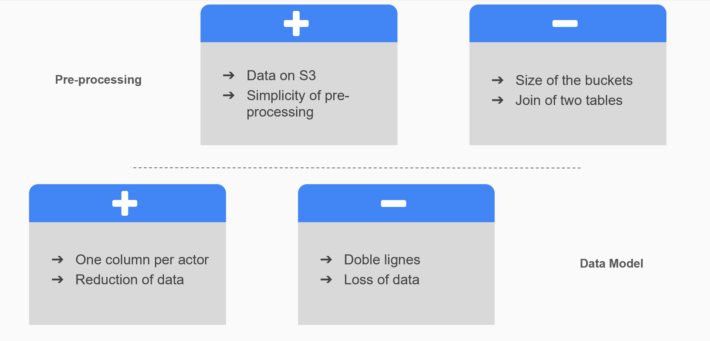

# GDELT_AWS_MongoDB
A project realised using the GDELT database. It uses an architecture built on Amazon Web Services (AWS) on an EMR cluster running MongoDB to access a year of data

## MongoDB with redundancy
- Valentin Larrieu
- Arnaud Lejeune
- Thomas Meimoun
- Thibault Royet
- David Tang

### Summary

#### I. Architecture

#### II. Prepossessing & Modeling

#### III. Advantages and flaws

#### IV.Demonstration

## I. Architecture

##### Our global architecture
 

##### MongoDB –Classic Architecture
 

##### Our Architecture
 

## II. Prepossessing & Modeling

##### Spark
 

##### Data Model
 

## III. Advantages and flaws

##### Architecture
 

##### Preprocessingand Data Model
 

## IV. Demonstration

See the ipnb files

# Appendices

##### Data Cleaning-Exemple
 

